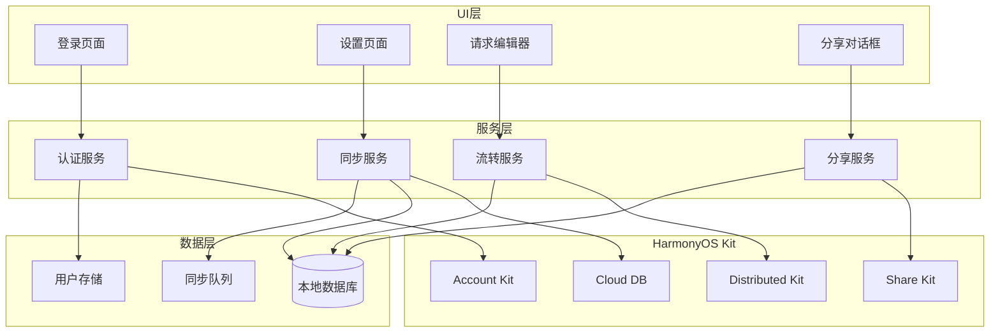
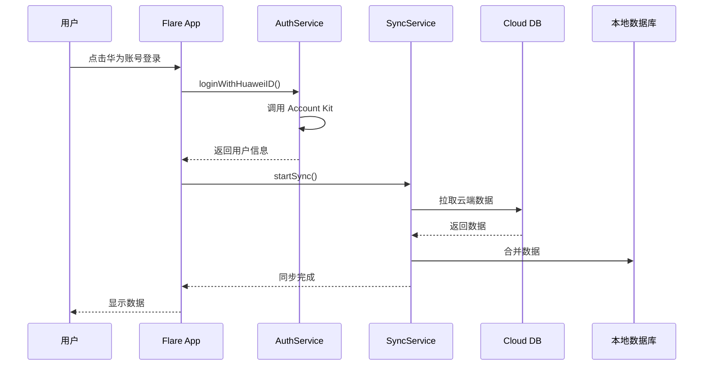

# 设计文档：HarmonyOS 系统特性集成

## 概述

本设计文档描述了 Flare 应用集成 HarmonyOS NEXT 系统特性的技术架构和实现方案。主要包括四大功能模块：华为账号登录（Account Kit）、云端数据同步（Cloud DB）、跨设备流转（Continuation）和系统分享（Share Kit）。

设计遵循以下原则：
- **模块化设计**：各功能模块独立，通过服务层解耦
- **离线优先**：核心功能在离线状态下可用
- **安全第一**：敏感数据端到端加密
- **用户体验**：无缝的多设备协作体验

---

## 架构

### 整体架构图



### 数据流架构



---

## 组件和接口

### 1. AuthService（认证服务）

负责华为账号登录、登出和用户状态管理。

```typescript
// AuthService.ets
interface UserInfo {
  unionId: string;
  openId: string;
  displayName: string;
  avatarUrl: string;
  email: string;
  isLoggedIn: boolean;
  loginTime: number;
}

interface AuthResult {
  success: boolean;
  user: UserInfo | null;
  error: string;
}

class AuthService {
  // 使用华为账号登录
  static async loginWithHuaweiID(): Promise<AuthResult>
  
  // 静默登录（已授权用户）
  static async silentLogin(): Promise<AuthResult>
  
  // 退出登录
  static async logout(clearLocalData: boolean): Promise<void>
  
  // 获取当前用户信息
  static getCurrentUser(): UserInfo | null
  
  // 检查登录状态
  static isLoggedIn(): boolean
  
  // 监听登录状态变化
  static onAuthStateChanged(callback: (user: UserInfo | null) => void): void
}
```

### 2. SyncService（同步服务）

负责本地数据与云端的双向同步。

```typescript
// SyncService.ets
interface SyncStatus {
  isOnline: boolean;
  isSyncing: boolean;
  lastSyncTime: number;
  pendingChanges: number;
  error: string | null;
}

interface SyncOptions {
  autoSync: boolean;
  wifiOnly: boolean;
  syncInterval: number; // 毫秒
  syncSensitiveData: boolean;
}

interface SyncChange {
  id: string;
  type: 'workspace' | 'request' | 'folder' | 'environment';
  action: 'create' | 'update' | 'delete';
  data: object;
  timestamp: number;
  synced: boolean;
}

class SyncService {
  // 初始化同步服务
  static async initialize(userId: string): Promise<void>
  
  // 开始同步
  static async startSync(): Promise<void>
  
  // 停止同步
  static stopSync(): void
  
  // 手动触发全量同步
  static async forceSync(): Promise<void>
  
  // 记录本地变更
  static recordChange(change: SyncChange): void
  
  // 获取同步状态
  static getSyncStatus(): SyncStatus
  
  // 更新同步选项
  static updateOptions(options: Partial<SyncOptions>): void
  
  // 解决冲突
  static async resolveConflict(localData: object, cloudData: object): Promise<object>
  
  // 监听同步状态变化
  static onSyncStatusChanged(callback: (status: SyncStatus) => void): void
}
```

### 3. ContinuationService（流转服务）

负责跨设备任务流转。

```typescript
// ContinuationService.ets
interface DeviceInfo {
  deviceId: string;
  deviceName: string;
  deviceType: 'phone' | 'tablet' | 'pc';
  isOnline: boolean;
}

interface ContinuationData {
  requestId: string;
  url: string;
  method: string;
  headers: Array<{name: string, value: string}>;
  body: string;
  bodyType: string;
  auth: object | null;
  activeTab: number;
}

interface ContinuationResult {
  success: boolean;
  targetDevice: DeviceInfo | null;
  error: string;
}

class ContinuationService {
  // 发现可用设备
  static async discoverDevices(): Promise<DeviceInfo[]>
  
  // 流转到目标设备
  static async continueToDevice(
    targetDeviceId: string, 
    data: ContinuationData
  ): Promise<ContinuationResult>
  
  // 接收流转数据
  static async receiveContinuation(): Promise<ContinuationData | null>
  
  // 注册流转接收回调
  static onContinuationReceived(callback: (data: ContinuationData) => void): void
  
  // 取消设备发现
  static stopDiscovery(): void
}
```

### 4. ShareService（分享服务）

负责数据分享和导入。

```typescript
// ShareService.ets
interface ShareData {
  type: 'request' | 'folder' | 'workspace' | 'curl';
  title: string;
  content: string;
  mimeType: string;
}

interface ImportResult {
  success: boolean;
  importedCount: number;
  errors: string[];
}

class ShareService {
  // 分享单个请求
  static async shareRequest(request: HttpRequest): Promise<void>
  
  // 分享文件夹
  static async shareFolder(folder: Folder, requests: HttpRequest[]): Promise<void>
  
  // 分享工作空间
  static async shareWorkspace(
    workspace: Workspace, 
    requests: HttpRequest[], 
    folders: Folder[], 
    environments: Environment[]
  ): Promise<void>
  
  // 分享为 cURL
  static async shareAsCurl(request: HttpRequest): Promise<void>
  
  // 导入分享数据
  static async importShareData(data: string, targetWorkspaceId: string): Promise<ImportResult>
  
  // 验证分享数据格式
  static validateShareData(data: string): boolean
  
  // 注册分享接收回调
  static onShareReceived(callback: (data: ShareData) => void): void
}
```

---

## 数据模型

### 用户数据模型

```typescript
// 用户信息（存储在本地）
interface StoredUserInfo {
  unionId: string;
  openId: string;
  displayName: string;
  avatarUrl: string;
  email: string;
  loginTime: number;
  lastSyncTime: number;
  syncOptions: SyncOptions;
}
```

### 同步队列数据模型

```typescript
// 同步队列项
interface SyncQueueItem {
  id: string;
  changeType: 'create' | 'update' | 'delete';
  entityType: 'workspace' | 'request' | 'folder' | 'environment';
  entityId: string;
  data: string; // JSON 序列化的数据
  timestamp: number;
  retryCount: number;
  lastError: string | null;
}
```

### 云端数据模型

```typescript
// 云端工作空间
interface CloudWorkspace {
  id: string;
  userId: string;
  name: string;
  description: string;
  createdAt: number;
  updatedAt: number;
  isDeleted: boolean;
}

// 云端请求
interface CloudRequest {
  id: string;
  userId: string;
  workspaceId: string;
  folderId: string | null;
  name: string;
  method: string;
  url: string;
  headers: string; // JSON
  queryParams: string; // JSON
  body: string;
  bodyType: string;
  auth: string; // JSON，加密存储
  sortOrder: number;
  createdAt: number;
  updatedAt: number;
  isDeleted: boolean;
}

// 云端文件夹
interface CloudFolder {
  id: string;
  userId: string;
  workspaceId: string;
  parentId: string | null;
  name: string;
  sortOrder: number;
  createdAt: number;
  updatedAt: number;
  isDeleted: boolean;
}

// 云端环境变量
interface CloudEnvironment {
  id: string;
  userId: string;
  workspaceId: string;
  name: string;
  variables: string; // JSON，敏感值加密
  createdAt: number;
  updatedAt: number;
  isDeleted: boolean;
}
```

---

## 正确性属性

*正确性属性是系统必须满足的形式化规范，用于验证实现的正确性。每个属性都是一个普遍量化的陈述，适用于所有有效输入。*

### 属性 1：登录状态持久化

*对于任意*用户，如果登录成功，则退出应用后重新打开，用户信息应该能够从本地存储中恢复。

**验证: 需求 1.4, 1.5**

### 属性 2：登出清除状态

*对于任意*已登录用户，执行登出操作后，本地存储中不应包含任何用户敏感信息。

**验证: 需求 1.6**

### 属性 3：数据变更同步完整性

*对于任意*数据变更（创建、修改、删除），同步到云端后再从云端拉取，应该得到等价的数据。

**验证: 需求 2.2, 2.3, 2.4, 2.5, 2.6**

### 属性 4：冲突解决一致性

*对于任意*本地和云端的数据冲突，采用"最后修改时间优先"策略后，结果应该是修改时间较新的那个版本。

**验证: 需求 2.7**

### 属性 5：离线队列完整性

*对于任意*离线期间的数据变更，网络恢复后，所有变更都应该被同步到云端，且顺序与发生顺序一致。

**验证: 需求 2.8, 7.3**

### 属性 6：流转数据往返一致性

*对于任意*请求数据，流转到目标设备后恢复的数据应该与源数据完全一致。

**验证: 需求 3.2, 3.3**

### 属性 7：导出数据完整性

*对于任意*请求、文件夹或工作空间，导出为 JSON 后再导入，应该得到等价的数据结构。

**验证: 需求 4.3, 4.4, 4.5, 4.8**

### 属性 8：cURL 生成正确性

*对于任意*有效的 HTTP 请求配置，生成的 cURL 命令应该能够正确表示该请求的所有参数。

**验证: 需求 4.6**

### 属性 9：敏感数据加密

*对于任意*包含敏感信息（密码、Token、API Key）的数据，同步到云端的数据应该是加密的，无法直接读取原文。

**验证: 需求 6.1**

### 属性 10：敏感数据过滤

*对于任意*启用"不同步敏感数据"选项的用户，同步到云端的数据中不应包含任何敏感字段。

**验证: 需求 6.3**

### 属性 11：响应缓存有效性

*对于任意*已缓存的请求响应，在离线模式下查看历史记录时，应该能够正确显示缓存的响应内容。

**验证: 需求 7.5**

---

## 错误处理

### 认证错误

| 错误场景 | 错误码 | 处理方式 |
|---------|--------|---------|
| 用户取消授权 | AUTH_CANCELLED | 返回登录界面，不显示错误 |
| 网络不可用 | AUTH_NETWORK_ERROR | 显示"网络不可用，请检查网络连接" |
| 账号被禁用 | AUTH_ACCOUNT_DISABLED | 显示"账号已被禁用，请联系客服" |
| Token 过期 | AUTH_TOKEN_EXPIRED | 自动尝试刷新 Token，失败则重新登录 |
| 未知错误 | AUTH_UNKNOWN | 显示"登录失败，请重试" |

### 同步错误

| 错误场景 | 错误码 | 处理方式 |
|---------|--------|---------|
| 网络不可用 | SYNC_NETWORK_ERROR | 将变更加入离线队列，显示离线指示 |
| 云端服务不可用 | SYNC_SERVICE_ERROR | 重试 3 次后暂停同步，显示错误提示 |
| 数据冲突 | SYNC_CONFLICT | 按冲突解决策略处理 |
| 存储配额超限 | SYNC_QUOTA_EXCEEDED | 显示"云端存储空间不足" |
| 数据格式错误 | SYNC_DATA_ERROR | 记录日志，跳过该条数据 |

### 流转错误

| 错误场景 | 错误码 | 处理方式 |
|---------|--------|---------|
| 目标设备离线 | CONT_DEVICE_OFFLINE | 显示"目标设备不在线" |
| 目标设备未安装应用 | CONT_APP_NOT_FOUND | 显示"请在目标设备上安装 Flare" |
| 流转超时 | CONT_TIMEOUT | 显示"流转超时，请重试" |
| 数据传输失败 | CONT_TRANSFER_ERROR | 显示"数据传输失败，请重试" |

### 分享错误

| 错误场景 | 错误码 | 处理方式 |
|---------|--------|---------|
| 数据格式无效 | SHARE_INVALID_FORMAT | 显示"无法识别的数据格式" |
| 数据版本不兼容 | SHARE_VERSION_MISMATCH | 显示"数据版本不兼容，请更新应用" |
| 导入失败 | SHARE_IMPORT_ERROR | 显示具体错误原因 |

---

## 测试策略

### 单元测试

- **AuthService**: 测试登录、登出、状态管理逻辑
- **SyncService**: 测试数据变更检测、冲突解决、队列管理
- **ContinuationService**: 测试数据序列化、反序列化
- **ShareService**: 测试数据导出、导入、格式验证

### 属性测试

使用属性测试框架验证核心属性：

1. **登录状态持久化测试**: 生成随机用户信息，验证存储和恢复的一致性
2. **数据同步往返测试**: 生成随机数据变更，验证同步后数据一致性
3. **冲突解决测试**: 生成随机冲突场景，验证解决策略正确性
4. **导出导入往返测试**: 生成随机请求数据，验证导出导入后数据一致性
5. **敏感数据加密测试**: 生成包含敏感信息的数据，验证加密后无法读取原文

### 集成测试

- 华为账号登录流程端到端测试
- 云端数据同步端到端测试
- 跨设备流转端到端测试
- 系统分享端到端测试

### 测试配置

- 属性测试最少运行 100 次迭代
- 每个属性测试需标注对应的设计文档属性编号
- 标签格式: **Feature: harmonyos-integration, Property {number}: {property_text}**

